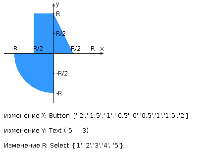
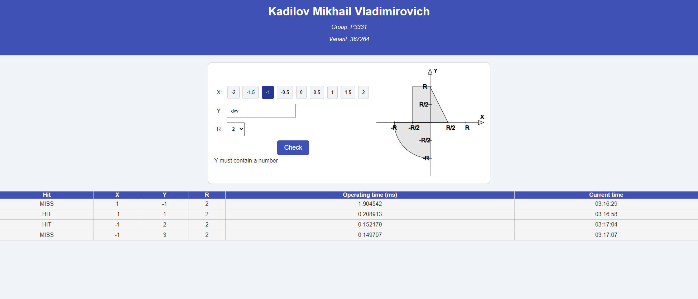

### Лабораторная работа #1

Вариант: 367259 + 5 = 367264



Разработать FastCGI сервер на языке Java, определяющий попадание точки на координатной плоскости в заданную область, и создать HTML-страницу, которая формирует данные для отправки их на обработку этому серверу.

Параметр R и координаты точки должны передаваться серверу посредством HTTP-запроса. Сервер должен выполнять валидацию данных и возвращать HTML-страницу с таблицей, содержащей полученные параметры и результат вычислений - факт попадания или непопадания точки в область (допускается в ответе сервера возвращать json строку, вместо html-страницы). Предыдущие результаты должны сохраняться между запросами и отображаться в таблице.

Кроме того, ответ должен содержать данные о текущем времени и времени работы скрипта.

**Комментарии по выполнению ЛР:**

- Требуется поднять Apache httpd веб-сервер от лица своего пользователя на гелиосе (шаблон файла конфигурации доступен для скачивания наверху страницы)
- Веб-сервер должен заниматься обслуживанием статического контента (html, css, js) и перенаправлять запросы за динамическим контентом к FastCGI серверу
- FastCGI сервер требуется реализовать на языке Java (полезная библиотека в помощь в виде jar архива доступна для скачивания наверху страницы) и поднять также на гелиосе
- **Путем обращений из JavaScript к FastCGI серверу требуется показать понимание принципа AJAX**

**Разработанная HTML-страница должна удовлетворять следующим требованиям:**

- Для расположения текстовых и графических элементов необходимо использовать табличную верстку.
- Данные формы должны передаваться на обработку посредством POST-запроса.
- Таблицы стилей должны располагаться в самом веб-документе.
- При работе с CSS должно быть продемонстрировано использование селекторов псевдоклассов, селекторов атрибутов, селекторов потомств, селекторов идентификаторов а также такие свойства стилей CSS, как наследование и каскадирование.
- HTML-страница должна иметь "шапку", содержащую ФИО студента, номер группы и новер варианта. При оформлении шапки необходимо явным образом задать шрифт (sans-serif), его цвет и размер в каскадной таблице стилей.
- Отступы элементов ввода должны задаваться в пикселях.
- Страница должна содержать сценарий на языке JavaScript, осуществляющий валидацию значений, вводимых пользователем в поля формы. Любые некорректные значения (например, буквы в координатах точки или отрицательный радиус) должны блокироваться.



### Запуск:
```
ssh -p 2222 -L 8080:localhost:34213 s367259@helios.cs.ifmo.ru
cd httpd-root/fcgi-bin/
httpd -f ~/httpd-root/conf/httpd.conf -k start
java -DFCGI_PORT=34214 -jar server.jar

http://localhost:8080
```